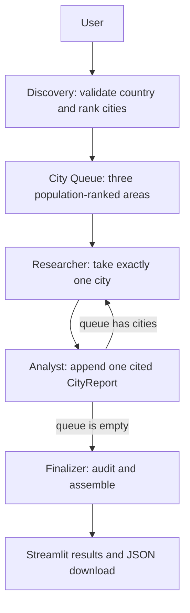

# Country & City Research Agent

A lightweight Python 3.11+ application that researches a country's three largest
urban/metropolitan areas and produces a cited travel report in Streamlit. It uses
You.com Search for evidence and a configurable LangChain chat model for structured
extraction. All working data is held in memory; there is no database, embedding
pipeline, browser automation or page scraper.

## Quick start

From the repository directory, create a virtual environment and install dependencies:

```powershell
python -m venv .venv
.venv\Scripts\Activate.ps1
python -m pip install -r requirements.txt
Copy-Item .env.example .env
```

On macOS/Linux:

```bash
python3 -m venv .venv
source .venv/bin/activate
python -m pip install -r requirements.txt
cp .env.example .env
```

Edit `.env`, filling `YOUCOM_API_KEY`, `LLM_MODEL`, and the key for your chosen
provider. Blank You.com host/path values use the defaults below. Then launch:

```bash
streamlit run app.py
```

Open the local URL printed by Streamlit. Enter a country and select **Run Research**.
The interface shows discovery, the current city's research section, completed cities,
methodology, population years, linked sources, missing-data notes and a JSON download.
The last completed report survives UI reruns within the current browser session.

Example inputs: `Japan`, `Brazil`, `United Kingdom`, `UK`, `USA`, `Czech Republic`,
or ISO codes such as `JP`. These inputs initiate live research; availability of a
supported top-three ranking is not guaranteed.

## Implemented architecture


The infographic shows the implemented workflow, shared state and external services.
The queue router is deterministic; the chat model is called only by Discovery and
Analyst. The node-level flow and responsibilities are detailed below.

## Why this is an agentic queue-based system

LangGraph owns a typed state and explicit transitions. The model interprets evidence
and constructs typed results at discovery and analysis boundaries. It does not
control routing or receive one giant prompt covering all cities. Search queries
are focused and invoked directly through a LangChain tool.



The actual compiled graph is `START → discovery → researcher → analyst`, followed
by the deterministic `queue_router`: `researcher` while cities remain, otherwise
`finalizer → END`. The queue is state, not a separate executable node. A successful
run executes eight nodes: one discovery, three researcher/analyst pairs, one finalizer.

### Nodes

| Component | Responsibility |
| --- | --- |
| `discovery_node` | Normalizes the input using ISO names/codes and explicit aliases; performs four population searches; extracts and validates exactly three distinct areas; sorts descending. |
| `researcher_node` | Takes the queue head without mutating the queue; performs three searches each for places, timing, and transportation; stores normalized evidence only. |
| `analyst_node` | Receives only the current candidate and its evidence bundle; generates one structured report; audits citations; appends one report and clears temporary state. |
| `queue_router` | Checks whether `city_queue` is empty. It makes no network or model calls. |
| `finalizer_node` | Requires exactly three matching reports and an empty queue; rechecks each city's evidence boundaries; deduplicates sources/warnings; produces the final report in population order. |

### State and reducer

`ResearchState` is a `TypedDict`. It contains input/normalized country, discovery
evidence, the discovered candidates, `city_queue`, `current_city`,
`current_city_raw_data`, reports, warnings, methodology and the final report.

```python
city_reports: Annotated[list[CityReport], operator.add]
warnings: Annotated[list[str], operator.add]
```

An analyst returns `{"city_reports": [report]}`. LangGraph adds that single item to
the earlier reports rather than replacing them. Returning the whole accumulated
list would duplicate reports, so nodes return only updates. Queue slicing and
dictionary expansion create new collections; nodes do not mutate shared lists.

`evidence_by_city` preserves a per-city retrieval audit trail after temporary state
is cleared. The finalizer uses it to reject a citation from another city's searches.
Neither this whole audit trail nor previous reports enter the analyst prompt.
The same source URL may legitimately support several cities if it was separately
retrieved for each. Population citations are checked against discovery evidence.

## Configuration

Environment variables override `.env`. Configuration and clients are initialized
only after submission, so the UI launches and all tests run without credentials.

| Variable | Default / behavior |
| --- | --- |
| `YOUCOM_API_KEY` | Required for live research. |
| `YOUCOM_BASE_URL` | Blank means `https://ydc-index.io`. Must be HTTPS. |
| `YOUCOM_SEARCH_PATH` | Blank means `/v1/search`. |
| `LLM_PROVIDER` | `openai` or `groq`; default `openai`. |
| `LLM_MODEL` | Required; exact model ID available to your provider account. |
| `OPENAI_API_KEY` | Required only with `LLM_PROVIDER=openai`. |
| `GROQ_API_KEY` | Required only with `LLM_PROVIDER=groq`. |
| `SEARCH_RESULT_COUNT` | `8`, range 1–100 per result section. |
| `PLACES_PER_CITY` | `5`, range 1–20. Fewer are returned when evidence is insufficient. |
| `HTTP_TIMEOUT_SECONDS` | `30`, positive and at most 300; used for HTTP/model requests. |
| `MAX_RETRIES` | `3`, range 0–8; retries after the initial request. |

### Model providers

For OpenAI, set `LLM_PROVIDER=openai`, `LLM_MODEL` and `OPENAI_API_KEY`. For Groq,
set `LLM_PROVIDER=groq`, `LLM_MODEL` and `GROQ_API_KEY`. Choose a chat model supporting
function/tool calling and temperature zero. Model names and account availability
change, so this repository does not silently select a model for you.

`llm_factory.py` is the only provider-specific module. It returns a common
`BaseChatModel` using `ChatOpenAI` or `ChatGroq`, with temperature zero, timeout and
retry settings. Graph nodes use `with_structured_output(..., method="function_calling")`
with generated JSON schemas. The returned dictionary is validated using strict
Pydantic JSON validation, preserving proper treatment of timestamp and URL strings
without accepting stringified integers. Provider-native strict JSON Schema mode is
not required; local strict validation always runs. Models with inadequate context
or function-calling support return a user-facing model configuration error.

If the provider rejects your key (HTTP 401), replace `OPENAI_API_KEY` or
`GROQ_API_KEY` for the selected provider in your local `.env` and restart Streamlit.
Do not paste keys into chat or commit them. A running process can retain old values;
environment variables exported by your shell also override `.env`.

To check model access independently of web research, run:

```bash
python check_model.py
```

This makes one small live model request using the discovery output schema and no
geographical evidence. It displays validation success or a safe error category,
HTTP status and recognized error code, without displaying credentials or response
bodies. Authentication, quota, rate limits and invalid report fields produce
different actionable messages in the UI.

### You.com Search

The client uses the documented **POST** Search endpoint:
`https://ydc-index.io/v1/search`, with `X-API-Key` authentication and a JSON body
containing `query` and `count`. It reads `results.web` and `results.news`, preserving
title, URL, description/snippets, publisher/domain, optional publication date and
the actual retrieval timestamp. It does not request full-page extraction.

`youcom_web_search(query: str, count: int = 8)` returns a list of normalized
dictionaries, not an untraceable prose blob. URL canonicalization is used only as
a deduplication key (host case, fragments, tracking parameters and query ordering).
The first result's original URL spelling is retained in the report, including its
query string. Schema validation still requires HTTP(S) URLs.

The client retries network errors and HTTP 429/500/502/503/504 with exponential
backoff: 1, 2, 4 seconds for the default three retries. Authentication errors fail
immediately. Other malformed or rejected responses produce clear errors. Partial
search failures become warnings; failed authentication stops the run. All-empty
city evidence produces explicit missing-data sections without an LLM call.

There are normally **31 search requests** (4 discovery + 9 per city) and **4 model
calls** (1 discovery + 3 analysis), before retries. Large result counts increase
latency, model context usage and provider cost. Each HTTP timeout applies per
request; it is not a deadline for the entire research run.

If discovery reports a search failure, verify the endpoint settings above and
restart Streamlit after editing `.env` (the running process may retain old values).
`https://api.you.com/search` is not the configured Search endpoint supported here.
Run a single live connection check without displaying credentials or response bodies:

```bash
python check_search.py --country Japan
```

This uses your configured search key and prints the HTTP status and usable result
count. It makes one Search API request. HTTP failures are shown separately from
successful responses that contain no usable evidence.

Never commit `.env`. Keys are held as `SecretStr` configuration and only sent to
the selected provider or configured search endpoint. Prompts contain evidence and
city metadata, never settings, HTTP headers or raw responses. The UI catches
errors without displaying SDK messages, stack traces or credentials.

## Ranking and grounding rules

1. Prefer a national statistics/census source, then an intergovernmental source,
   metropolitan authority, demographic database or reputable secondary source.
2. Require evidence of the national top three, a common population definition and
   an identified dataset. Do not compare city-proper with metro populations.
3. Every population must have a year and a cited snippet containing that figure
   and year. Exact decimal million/billion/thousand expansions are supported;
   unsupported estimates are rejected. Future-year projections are rejected.
4. An urban-agglomeration fallback is disclosed. Mixed years and disagreements
   carry warnings. The code sorts verified positive population integers.
5. An invalid or fictional input is rejected, never fuzzy-matched to another
   country. Ambiguous inputs such as `Congo` or `Korea` ask the user to specify.
   ISO's country/territory catalog defines the accepted geographical names; this
   is not a determination of sovereignty. Alternate spellings not in that catalog
   or the explicit alias table require the official name or ISO code.
6. Countries with fewer than three recognized areas, or insufficient comparable
   evidence, receive an explicit limitation error. A fabricated or partial
   three-city report is never presented as complete.
7. Citations must belong to the current city and the relevant topic's retrieved
   evidence. Empty snippets cannot support recommendations. Source metadata comes
   from retrieval, not the model; only actually cited sources enter the report.
8. Unsourced timing and transport sections are replaced with
   `Data not found in the retrieved sources`. Attractions require citations in
   the schema. Missing details reduce report confidence; no missing information
   is invented during finalization.

## Output structure

The JSON download is a complete `CountryResearchReport`. Its exact contract is in
`schemas.py`; every object forbids unknown fields. `cities` contains exactly three
`CityReport` objects with these fields:

```text
CountryResearchReport
  country, ranking_basis, population_data_note
  cities[3]
    city
      city_name, metro_or_urban_area_name, country
      population, population_year, population_definition
      source_urls[], confidence, notes
    important_places[]
      name, category, short_description, why_visit, source_urls[]
    best_time_to_visit
      recommended_months[], summary, weather_considerations
      crowd_or_price_considerations, source_urls[]
    getting_around
      recommended_primary_mode, explanation, public_transport_options[]
      alternatives[], practical_tips[], accessibility_or_safety_notes[], source_urls[]
    sources[]
      title, url, publisher, accessed_at, supports[]
    missing_information[], confidence
  generated_at, warnings[]
```

Population/year fields permit `null` at extraction boundaries, but a successful
ranking requires known positive population figures and years. Timestamps are ISO
8601 in JSON. Confidence is `high`, `medium` or `low`. A runnable synthetic example
is produced by the mocked end-to-end tests; Alpha/Beta/Gamma in those fixtures are
test labels and make no factual claims about Japan.

## Testing and verification

```bash
python -m pytest -q
python -m pip check
python -m compileall -q app.py graph.py state.py schemas.py prompts.py config.py llm_factory.py clients tools nodes
```

Tests use `httpx.MockTransport` and mock structured model responses. No live API
keys or research calls are needed. Coverage includes:

- Discovery ranking, input aliases/ambiguity, insufficient evidence, invented
  figures and mixed population definitions.
- Real compiled LangGraph routing and eight-node execution order, additive report
  accumulation, one-city prompt isolation and temporary-state cleanup.
- Citation boundaries, missing evidence, malformed populations/URLs and exact
  URL serialization.
- Provider creation/configuration, HTTP authentication, retries, deduplication,
  malformed responses and safe errors.
- Both actual LangChain provider adapters with mocked SDK responses and a guard
  against external HTTP requests.
- Streamlit country validation and a full mocked submission using `AppTest`, plus
  real headless CLI startup and a localhost health check.

For a manual server smoke test:

```bash
streamlit run app.py --server.headless true --server.port 8501
```

Open `http://localhost:8501`; the health endpoint is `/_stcore/health`.
Live end-to-end validation additionally requires your own valid search/model keys
and sufficient credits. Mock tests establish orchestration and contracts, not
the factual accuracy of a future live report.

## Repository map

- `app.py`: Streamlit UI and progress reporting.
- `graph.py`, `state.py`: state machine, queue router and reducers.
- `schemas.py`, `prompts.py`: strict data contracts and evidence instructions.
- `config.py`, `llm_factory.py`: environment configuration and model construction.
- `countries.py`, `evidence.py`, `errors.py`: input normalization, citation audits,
  population checks and safe public exceptions.
- `clients/youcom_client.py`: HTTP transport and normalized results.
- `tools/youcom_tools.py`: focused LangChain search tool.
- `nodes/`: discovery, researcher, analyst, finalizer and shared extraction helpers.
- `tests/`: credential-free unit, graph integration and UI tests.

## Limitations

Search snippets may omit census tables, exact numbers or context. This deliberately
conservative implementation stops when ranking cannot be verified rather than
scraping around that limitation. Space-separated/localized numbers may fail the
simple population check. The newest retrieved dataset is not guaranteed to be the
newest published dataset. Metro boundaries, urban definitions and census years vary
by country, so rankings are not comparable across countries without further work.

URL provenance and numeric presence checks do **not** prove semantic entailment:
a passage can mention a number for another entity, and a retrieved citation can
still be misinterpreted. Source authority, dataset consistency, overlapping metro
boundaries, contradictory claims and most confidence assessments depend on the
model's evidence interpretation. Read the linked original sources before relying
on the report. Prompt-injection instructions in retrieved text are explicitly
ignored by the system prompt, but this is not a formal security guarantee.

The application favors concise visitor guidance. Seasonal conditions, accessibility
and transport service change; detailed real-time service verification is outside
its scope. It makes no bookings and does not persist reports across server restarts.

## Official implementation references

- [You.com Search request and result contract](https://you.com/docs/api-reference/search/v1-search)
- [LangGraph state, reducers and conditional edges](https://docs.langchain.com/oss/python/langgraph/graph-api)
- [LangChain ChatGroq integration](https://docs.langchain.com/oss/python/integrations/chat/groq)
- [OpenAI structured outputs](https://developers.openai.com/api/docs/guides/structured-outputs)
