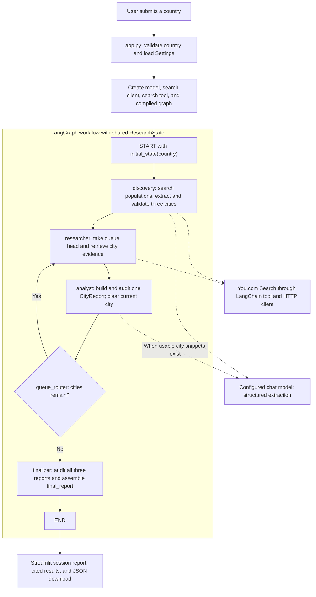

# Architecture and execution workflow

This guide describes the implementation in this repository, using `app.py`,
`graph.py`, the node modules, and their supporting contracts as the source of truth.

## 1. Architecture overview

The application accepts a country, identifies its three largest supported urban or
metropolitan areas, and produces a population-ranked travel report. Each city report
contains important places, visit timing, local transportation, sources, confidence,
and explicit missing-information notes.

The architecture has five cooperating layers:

| Layer | Components | Responsibility |
| --- | --- | --- |
| Presentation and composition | `app.py` | Collect input, construct dependencies, stream graph updates, show progress, render results, and offer JSON export. |
| Workflow orchestration | `graph.py`, `state.py` | Define the graph, deterministic routing, shared state, and accumulation rules. |
| Research processing | `nodes/`, `prompts.py` | Discover cities, retrieve city evidence, extract one report at a time, and assemble the country report. |
| Contracts and evidence validation | `schemas.py`, `evidence.py`, `countries.py`, `errors.py` | Validate data shape, country identity, population evidence, citation boundaries, and safe public errors. |
| External integrations | `config.py`, `llm_factory.py`, `tools/youcom_tools.py`, `clients/youcom_client.py` | Load settings, construct the model, expose search as a LangChain tool, and perform HTTP requests. |

LangGraph owns execution and state transitions. LangChain supplies the common chat
model and tool interfaces. Pydantic validates retrieved and generated data.
Streamlit owns the interactive session. You.com supplies search snippets, while
the configured OpenAI or Groq model performs structured extraction.

Only Discovery and Analyst invoke the model. Search queries and graph transitions
are defined in Python. The tool is called directly by nodes through a helper;
there is no model-selected tool loop or `ToolNode` in this graph.

## 2. Project layout

```text
metro-city-research-agent/
|-- app.py                       # Streamlit entry point and dependency composition
|-- graph.py                     # Graph builder and queue_router
|-- state.py                     # ResearchState and initial_state
|-- schemas.py                   # Strict Pydantic evidence and report contracts
|-- prompts.py                   # Evidence rules and extraction instructions
|-- evidence.py                  # Population checks and report citation audits
|-- countries.py                 # Exact country normalization and aliases
|-- errors.py                    # User-facing exception hierarchy
|-- config.py                    # Lazy environment configuration
|-- llm_factory.py               # OpenAI/Groq chat-model construction
|-- check_model.py               # Standalone live model diagnostic
|-- check_search.py              # Standalone live search diagnostic
|-- clients/
|   |-- __init__.py
|   `-- youcom_client.py         # HTTP transport, retries, normalization, deduplication
|-- tools/
|   |-- __init__.py
|   `-- youcom_tools.py          # LangChain search-tool adapter
|-- nodes/
|   |-- __init__.py
|   |-- common.py               # Search runner, structured extraction, safe model errors
|   |-- discovery.py            # Country-wide population ranking
|   |-- researcher.py           # Evidence retrieval for one queued city
|   |-- analyst.py              # Structured city report and evidence audit
|   `-- finalizer.py            # Completion checks and country report assembly
|-- tests/                      # Unit, graph integration, UI, and server checks
|-- docs/
|   |-- architecture-and-workflow.md
|   `-- images/                 # Existing architecture image and prompt
|-- .env.example                # Configuration template
|-- .env                        # Local credentials and settings
|-- .gitignore
|-- pytest.ini
|-- requirements.txt
`-- README.md                   # Setup, configuration, and operating guidance
```

This is a module-based Python application launched from the repository directory.
The UI constructs dependencies and passes them into `build_graph`; node functions
receive those dependencies through `functools.partial`. This keeps the graph usable
with fake models and tools in tests, without starting Streamlit or making live calls.

## 3. Execution workflow

Solid arrows below show execution order. Dotted arrows show service calls. The
queue decision is a conditional-edge function, not a separately registered node.



### Step 1: Accept input and create dependencies

`app.main()` clears the previous report when a new run is submitted. It calls
`normalize_country()` before loading credentials so an invalid or ambiguous country
can be reported immediately. Normalization uses exact ISO names/codes and explicit
aliases; it does not fuzzy-match a different country.

`Settings.from_env()` loads `.env` without overriding existing environment variables
and validates search configuration. `create_llm()` validates provider/model settings
and constructs a chat model with temperature zero, timeout, and retry settings.
The model ID must be configured explicitly.

A context-managed `YouComClient` supplies the search tool. `build_graph()` binds
the model, tool, settings, and progress callback to nodes, then compiles the graph.
The HTTP client is closed when the context exits, including on failure.

### Step 2: Initialize state and start streaming

The UI starts execution with:

```python
workflow.stream(
    initial_state(country),
    config={"recursion_limit": 20},
    stream_mode="updates",
)
```

Initial state contains the input country, empty queue/report/warning collections,
an empty evidence audit trail, and `None` for current-city data and the final report.
Update streaming exposes each completed node's returned changes to the UI. Progress
messages from inside nodes also update the status label. This is node-level progress;
the code does not stream model tokens.

The scrollable **Workflow activity: You.com and LLM calls** panel records numbered
messages in execution order. Stage messages identify Discovery and each city's
research/analysis. Each live search displays its query and start/completion or failure;
structured extraction displays LLM start/completion or failure. An analyst with no
usable snippets explicitly reports that its LLM call was skipped. These messages
describe logical calls, with automatic retries included inside each call. The log
persists in the Streamlit session across reruns and is reset by a new submission or
the Clear button, including when a previous run failed.

### Step 3: Discover and rank exactly three cities

`discovery_node()` normalizes the country again so graph execution also validates
input independently of the UI. It runs four population searches and deduplicates
the retrieved results. If usable snippets exist, `extract()` asks the model for a
`DiscoveryExtraction` using those normalized results and the current UTC year.

Discovery then checks that:

- Exactly three distinct areas belong to the normalized country.
- The extraction declares a supported ranking, consistent definition, and named dataset.
- All candidates use the same population-definition label and avoid city-proper data.
- Population citations occur in retrieved, nonempty evidence.
- Each candidate has a population and a nonfuture year that appear together in a cited snippet.

It sorts the candidates by descending population and writes both `discovered_cities`
and a separate `city_queue`. It also saves discovery evidence, ranking methodology,
population notes, and warnings. Unsupported discovery stops the run; the workflow
does not manufacture three cities to fill the queue.

### Step 4: Research the queue head

`researcher_node()` selects exactly one city and returns the remaining queue. It
executes three queries for each of three topics: places, timing, and transportation.
These nine searches run sequentially, with results deduplicated within each topic.

The resulting `CityResearchBundle` becomes `current_city_raw_data`, alongside
`current_city`. A copy of the evidence reference is retained in `evidence_by_city`,
keyed by case-folded country and metro/urban-area name. This audit trail survives
the clearing of temporary fields after analysis.

### Step 5: Analyze and audit one city

`analyst_node()` sends only the current candidate, its evidence bundle, and the
requested number of places to the model. Previous reports and the full multi-city
audit trail are excluded from the prompt.

If the entire bundle has no usable snippets, the node skips the model call and
constructs a low-confidence report with explicit missing-data fields. Otherwise,
`extract()` requests a structured `CityReport`.

The analyst audits the report, limits and deduplicates place recommendations, records
any shortage, and audits again. It returns a one-item report update and clears
`current_city` and `current_city_raw_data`. The historical evidence remains available
for final validation.

### Step 6: Route deterministically

After every analyst execution, `queue_router()` returns `researcher` if the queue
is nonempty, otherwise `finalizer`. It performs no model or network request.

For a successful run, state evolves as follows:

| Completed stage | Queue length | Current city | Accumulated reports |
| --- | ---: | --- | ---: |
| Discovery | 3 | None | 0 |
| First Researcher | 2 | First city | 0 |
| First Analyst | 2 | None | 1 |
| Second Researcher | 1 | Second city | 1 |
| Second Analyst | 1 | None | 2 |
| Third Researcher | 0 | Third city | 2 |
| Third Analyst | 0 | None | 3 |
| Finalizer | 0 | None | 3 |

The third city is still analyzed even though Researcher has emptied the queue:
the conditional edge is evaluated only after Analyst.

### Step 7: Finalize and display

`finalizer_node()` requires exactly three reports matching the three discovered
areas, an empty queue, and no active current city. It retrieves each city's saved
evidence and re-audits every report. It then restores population order, deduplicates
warnings, incorporates relevant population caveats, and creates a timestamped
`CountryResearchReport` in `final_report`.

The UI stores this report in `st.session_state`, renders citations and missing-data
notes, and exposes `model_dump_json(indent=2)` as a download. The completed report
survives normal reruns within the browser session. The full graph state and evidence
trail are not included in that report export.

## 4. State and data contracts

`ResearchState` is a `TypedDict(total=False)`: fields can be populated progressively.
It describes the graph's state structure; runtime evidence/report validation comes
from Pydantic models and explicit node checks.

| State fields | Purpose and update behavior |
| --- | --- |
| `input_country`, `normalized_country` | Original input and validated country identity. |
| `discovery_raw_data`, `discovery_results` | Serialized normalized discovery results and their typed equivalents; the raw-data field is not an unprocessed HTTP response. |
| `discovered_cities`, `city_queue` | Stable ranked candidates and the shrinking work queue. |
| `current_city`, `current_city_raw_data` | Temporary candidate and typed evidence bundle for one iteration. |
| `city_reports` | Append-only node updates combined through `operator.add`. |
| `warnings` | Warning updates combined through `operator.add`; duplicates removed at finalization. |
| `evidence_by_city` | Retained audit bundles; Researcher explicitly returns a merged dictionary. |
| `ranking_basis`, `population_data_note` | Discovery methodology and limitations. |
| `final_report` | Final validated country report. |

Only reports and warnings have accumulation reducers:

```python
city_reports: Annotated[list[CityReport], operator.add]
warnings: Annotated[list[str], operator.add]
```

An analyst returns `{"city_reports": [report]}`, not the entire report history.
Returning the history would append it again and duplicate records. Other state
fields use replacement updates; in particular, `evidence_by_city` has no automatic
dictionary-merge reducer. Queue slicing and dictionary expansion preserve earlier
collections rather than mutating them in place.

The principal schema chain is:

```text
SearchResult -> DiscoveryExtraction -> CityCandidate
SearchResult grouped by topic -> CityResearchBundle
CityCandidate + CityResearchBundle -> CityReport
Three audited CityReports + methodology -> CountryResearchReport
```

Schemas forbid extra fields, enable strict validation, constrain numbers and enums,
and validate HTTP URLs while preserving their original spelling for citations.
`extract()` passes a generated JSON schema to `with_structured_output()` with
`method="function_calling"`, then validates returned dictionaries as JSON. This
permits JSON timestamp and URL strings while rejecting stringified population
integers. An already-instantiated result of the requested schema is returned directly.

## 5. Search, evidence, and failure handling

The search path is `run_searches()` -> LangChain search tool -> `YouComClient.search()`.
The client sends a POST with `query` and `count`, using `X-API-Key` authentication.
It normalizes web/news results into `SearchResult` objects, combining descriptions
and snippets and recording actual retrieval timestamps. Canonical URLs are used
only as deduplication keys; citation URLs retain their supplied spelling.

`audit_report()` enforces distinct citation boundaries: population URLs must occur
in discovery evidence, place URLs in this city's places evidence, timing URLs in
its timing evidence, and transport URLs in its transportation evidence. Missing
timing or transport citations cause those sections to be replaced with missing-data
content. Source metadata is rebuilt from retrieval records, and missing information
can lower report confidence.

| Situation | Implemented behavior |
| --- | --- |
| Invalid country or settings | Raise a safe domain error; stop the run. |
| Search connection failure or HTTP 429/500/502/503/504 | Retry with exponential delays, up to `MAX_RETRIES` retries after the first attempt. |
| Search authentication/access/credit failure | Raise `SearchAuthenticationError`; abort rather than continue with warnings. |
| Other handled search failures | `run_searches()` records warnings and continues with other queries. |
| No usable discovery evidence or unsupported ranking | Stop with a search or ranking error. |
| No usable evidence for a discovered city's travel details | Produce an explicit missing-data report; population evidence is retained. |
| Model failure or invalid structured output | Convert to `ModelError`; stop the run. |
| Invalid citation or changed city identity | Raise `EvidenceError`; stop the run. |
| Unexpected exception | UI shows a generic message rather than SDK details. |

There is no graph-level retry, repair loop, or resume checkpoint. HTTP retries and
configured model-client retries are separate from graph execution. A new submission
starts a new run and clears the previously displayed report.

## 6. Runtime characteristics and implementation boundaries

A complete run executes **eight nodes**: one Discovery, three Researcher/Analyst
pairs, and one Finalizer. It issues **31 logical search queries**: four discovery
queries plus nine for each city. Normally it makes **four structured model
invocations**; analysts with entirely empty usable evidence skip their invocation.
Transport/provider retries can increase the number of actual outbound requests.

Execution is synchronous and sequential. The UI progress bar counts completed nodes
out of eight; it does not estimate elapsed time or account for individual retries.
Increasing search-result count increases evidence volume and model context use.

Working data lives in memory. The graph is compiled without a checkpointer, and
the project has no database, vector store, embedding pipeline, full-page scraper,
background worker, or parallel city execution. Restarting the server loses the
in-memory report; a user can preserve the final report through JSON export.

Citation provenance and population-number presence are mechanically checked, but
these checks do not prove that a passage supports every claim. Dataset authority,
non-overlapping area interpretation, and much of semantic consistency still depend
on model extraction. Search snippets can omit necessary context, and the workflow
does not guarantee discovery of the newest published population dataset.

## 7. Verification and reading order

The existing tests cover HTTP normalization/retries, schema strictness, discovery
validation, citation isolation, queue routing, reducer accumulation, finalization,
provider adapter contracts, Streamlit interactions, and headless server startup.
They use fake models, tools, or transports for credential-free workflow checks.

From the repository directory, run the suite with:

```powershell
.venv\Scripts\python.exe -m pytest
```

`check_model.py` and `check_search.py` are separate live integration diagnostics;
they require the corresponding configuration and external service access.

For a first code walkthrough, read `app.py` -> `graph.py` -> `state.py` -> the four
node modules -> `schemas.py` and `evidence.py` -> the search client and model factory.
The setup instructions and complete configuration table are in [README.md](../README.md).
